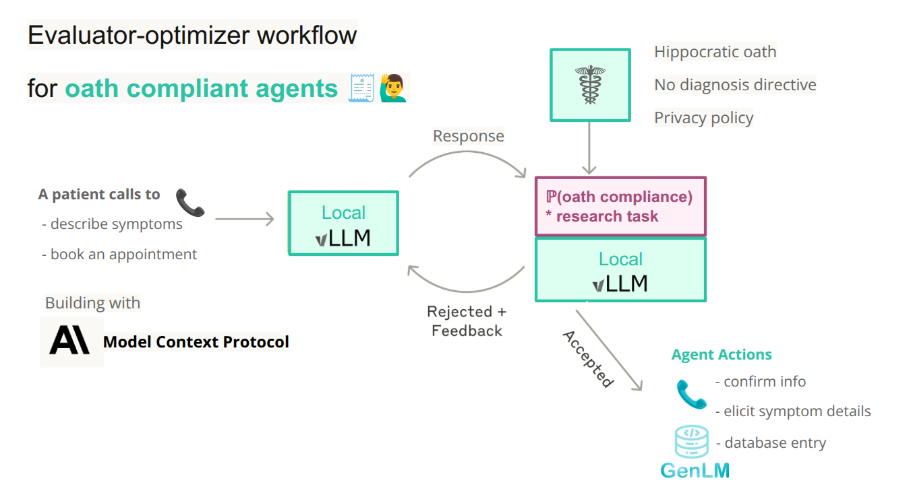

### Oath keeping Agents

This project aims to improve patient outcomes by using multi-agent systems to ellicit detailed information from patients about their symptoms as they happening. Using probabilistic computing we estimate the probability of deviant behaviours such as breaking the Hippocratic oath or diagnosing the patient.



### Quick start

This project uses the uv package manager (https://github.com/astral-sh/uv)

```bash
uv pip install -e .[gpu,dev]
```

For cpu-only builds

```bash
uv run bash vllm-cpu.sh
uv pip install -e .[cpu,dev]
```

### Funding Sources

This work was supported by the Cross-ministerial Strategic Innovation Promotion Program (SIP) on “Integrated Health Care System” Grant Number JPJ012425.
